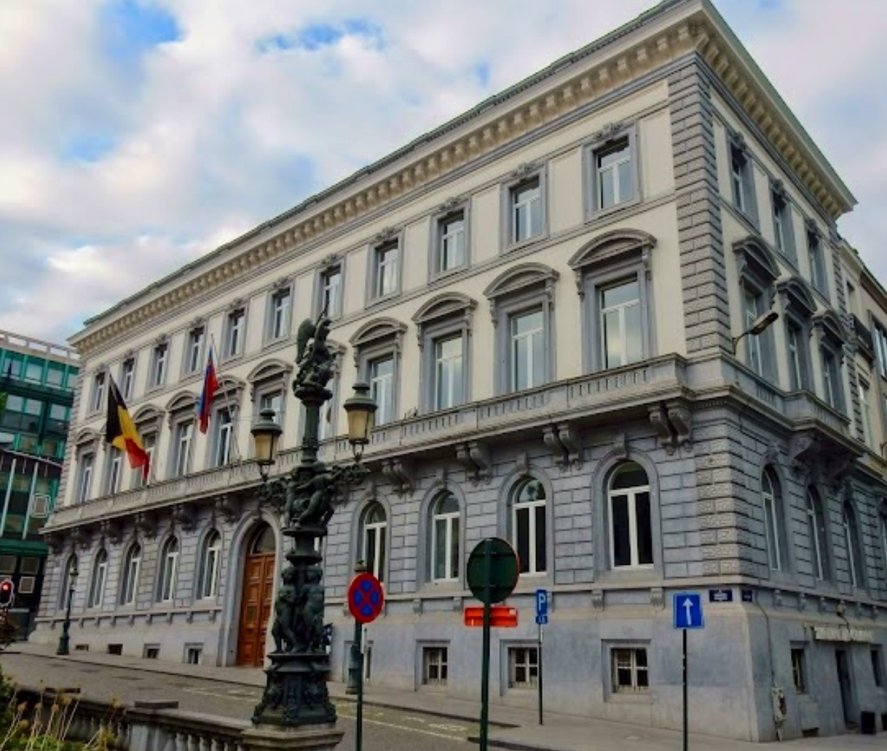

---
---

<link rel="stylesheet" href="styles.css" type="text/css">

  

**Visiting address (EU)**    
Centre for European Policy Studies  
Place du Congrès 1    
1000 Brussels   
Belgium   
+32 (0) 2 229 39 11   
pierre-alexandre.balland@ceps.eu   

\
\

**Visiting address (US)**      
Harvard University     
John F. Kennedy School of Government   
Rubenstein Building - Office 519   
79 John F. Kennedy Street   
Cambridge, MA 02138   
+1 617-495-1100   
pballand@hks.harvard.edu    
