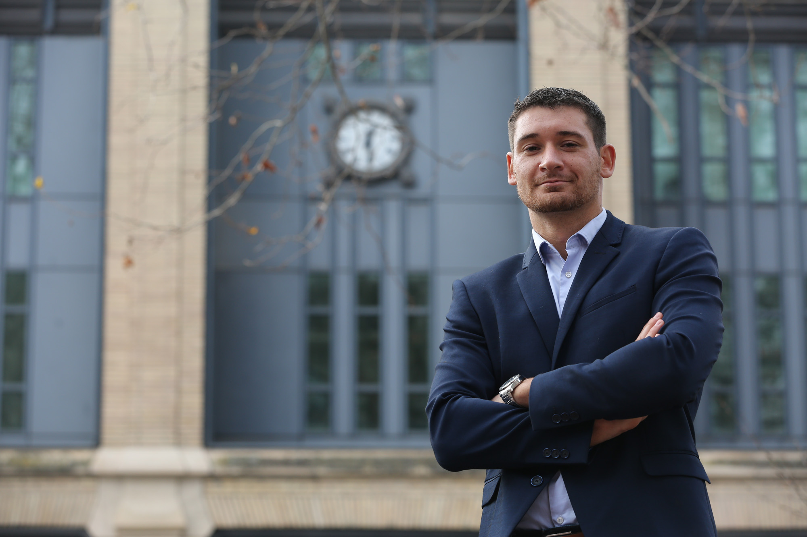

---
---

<link rel="stylesheet" href="styles.css" type="text/css">

 
Pierre-Alexandre Balland is a French economist and a [leading expert](https://scholar.google.com/citations?user=ORZg_McAAAAJ&hl=en&oi=ao) in complex economic systems and artificial intelligence.

Pierre-Alexandre currently serves as Chief Data Scientist at [CEPS](https://www.ceps.eu/ceps-staff/pierre-alexandre-balland/) and is a Visiting Professor at [Harvard University's Growth Lab](https://growthlab.hks.harvard.edu/people/pierre-alexandre-balland). He is also the director of the [AI World](https://aiworld.eu/) and advises the European Commission and several governments on research & innovation policy.   

 
Pierre-Alexandre Balland has also been named among [Clarivate’s Highly Cited Researchers 2025](https://clarivate.com/highly-cited-researchers/?action=clv_hcr_members_filter&clv-paged=1&clv-category=&clv-institution=&clv-region=&clv-name=balland), a distinction awarded to scientists whose work has had a significant and broad influence and whose publications rank in the top 1% most cited worldwide. He also ranks among the most cited economists worldwide according to [RePEc](https://ideas.repec.org/top/top.person.all10.html) (as of September 2025). He teaches AI for business leaders, machine learning, economic complexity and is a frequent keynote speaker. He has most recently presented at [Slush](https://slush.org/speakers/pierre-alexandre-balland-chief-data-scientist-ceps/), [Unleash World](https://www.unleash.ai/unleashworld/contributors/pierre-alexandre-balland/), the [Ideas Lab](https://www.ceps.eu/ceps-ideas-lab/) & [VivaTech](https://vivatechnology.com/). 

At the Centre for European Policy Studies (CEPS), Pierre-Alex leads a team that leverages [artificial intelligence](https://aiworld.eu/) and data science tools to address a wide range of public policy challenges, ranging from [AI strategy & policy](https://www.ceps.eu/ceps-publications/forge-ahead-or-fall-behind/), [industrial & innovation policy](https://commission.europa.eu/document/download/ec1409c1-d4b4-4882-8bdd-3519f86bbb92_en?filename=The%20future%20of%20European%20competitiveness_%20In-depth%20analysis%20and%20recommendations_0.pdf), [political polarization](https://www.ceps.eu/in-french-legislative-elections-the-far-right-will-probably-fall-short/) or [Ukraine's reconstruction](https://www.ceps.eu/ukraine-isnt-a-financial-burden-but-an-opportunity-for-the-eus-digital-transition/). 

At Harvard's Growth Lab, he works with the academic team to advance fundamental research on economic complexity and its applications to technological change, industrial policy, green growth, and the future of work. He previously held positions at [Utrecht University](https://www.uu.nl/staff/PMABalland/Profile), [MIT](https://www.media.mit.edu/people/balland/overview/), [UCLA](https://www.ucla.edu/), the [Artificial and Natural Intelligence Toulouse Institute](https://en.univ-toulouse.fr/aniti) and the [Center for Complex Systems Studies](https://www.uu.nl/en/research/centre-for-complex-systems-studies-ccss).  

Pierre-Alexandre Balland is also an experienced entrepreneur, passionate about bridging the gap between the lab and the market. In 2018, he co-founded Argos to develop AI solutions. In 2022, he co-founded 71West to accelerate blockchain development for environmental impact. Most recently, he co-founded [General Robotics](https://www.general-robotics.com/).  

CEPS projects & policy insights: Pierre-Alexandre.Balland@ceps.eu     
Academic collaborations & research: pballand@hks.harvard.edu   
AI solutions, speaking engagement & business opportunities: pa@argosgroup.net     

[Download Full CV](https://www.paballand.com/cv.pdf) 

