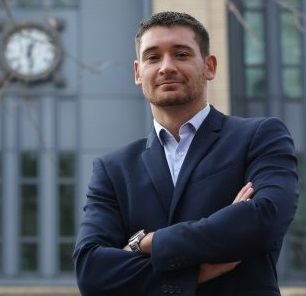

---
---

<link rel="stylesheet" href="styles.css" type="text/css">

I am an Assistant Professor of Economic Geography at [Utrecht University](https://www.uu.nl/en),  and research fellow at the [Center for Complex Systems Studies](https://www.uu.nl/en/research/centre-for-complex-systems-studies-ccss). I previously held positions at [MIT](https://www.media.mit.edu/people/balland/overview/), [UCLA](https://www.ucla.edu/), [Lund University](https://www.lunduniversity.lu.se/), and the [University of Toulouse](https://en.univ-toulouse.fr/). 

I am an economist by training, and I try to understand why some parts of the world are rich, other poor, and what we can do about it.   

On a more applied side, I work with policymakers and companies to solve real-world problems using network analysis and complex systems thinking. I currently serve in the expert group [ESIR](https://ec.europa.eu/info/research-and-innovation/strategy/support-policy-making/support-eu-research-and-innovation-policy-making/esir_en) that advises the European Commission on Research and Innovation policy.  

On this website, you'll find data, codes, journal articles, and news about my team and my research.